# Real-Time Order Processing System — System Design

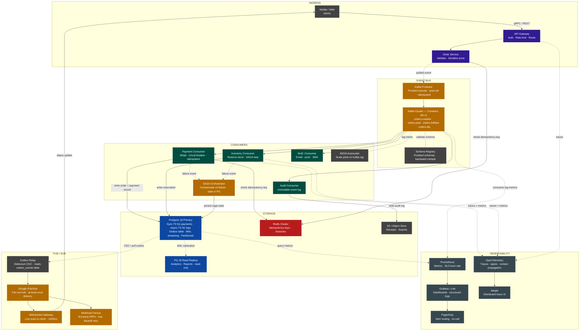

---

## Key design decisions

- **Outbox pattern** — Postgres and Kafka writes are atomic via the `outbox_events` table; Debezium CDC relays to Pub/Sub, guaranteeing no lost events even on crash.
- **SAGA orchestrator state** — persisted in the primary so it survives restarts and can resume mid-flow.
- **Read replica** — receives only WAL replication from primary; no application writes ever target it.
- **Idempotency keys** — checked in Redis by the Order Service on ingress and by the Payment Consumer before charging, preventing duplicate orders and double charges.
- **Google Pub/Sub as fan-out hub** — WebSocket Gateway and Webhook Fanout are both *subscribers*; adding a new subscriber (e.g. a data warehouse connector) requires no changes to upstream services.

## Design


This is the top level data flow layer where data flows from API Gateway to producer into Kafka cluster.

Once the event is on Kafka, four independent consumer services read it in parallel. Here is the SAGA orchestrator design


Finally, the storage and real-time delivery layer - where the postgres outbox bridges the internal event bus to the customer-facing push layer.


## 1. Ingress and Kafka Tier
How a customer's tap-to-order becomes a durable event on the Kafka bus.

### Client
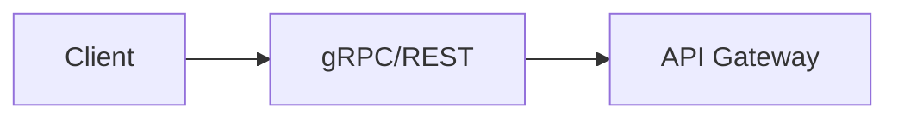
User taps on 'place order', the client sends an `HTTP/2` request using `gRPC`(mobiles), `HTTP`(browsers). Every request is encrypted over TLS. We use golang's gRPC package for this.

Client also generates an <b>idempotency key</b> - random UUID and attaches it to every request. If the network drops and client retries, this key lets the server recognize the duplicate and return the original result instead of placing the order <b>twice</b>

`Why gRPC?` -> gRPC uses Protobuf which is 10x smaller than JSON and strongly typed. So, a change in schema does not break the old clients because Protobuf ignores unknown fields.

### API Gateway
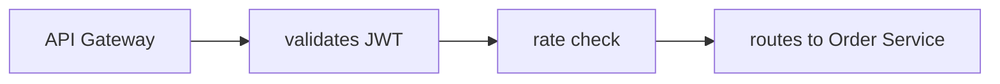
It is a single public facing entry point. Before any request touches the business logic, the gateway performs three things in order

- Authentication:- It validates the `JWT` token in the Authorization header. Invalid or expired tokens are rejected with a `401 Unauthorized` 
- Rate limiting:- Each customer is capped at a configurable request rate (e.b 100 req/s). This prevents a single bad actor or client from flooding the Order Service. Response above the limit get `429 Too many Requests`.
- Routing:- Based on the path and headers, the gateway routes the request to the correct upstream - in this case `Order Service`. In other largers systems, API Gateway also handles `A/B` routing, canary splits and header injection

The gateway also terminates TLS, so internal services communicate over plaintext within the cluster - simplifying mTLS configuration for internal hops. 

In Golang, `net/http` handles concurrency with goroutines per connection - no thread pool configuration needed. Each request gets its own goroutine, context-cancelled on client disconnect.

### Order Service
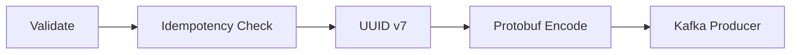

This is the first piece of business logic. It recieves the authenticated, rate-limited request from the gateway and does 4 things:

- Validates the request:- Is the customer's cart non-empty? Are all item IDs valid? Is the delivery address in a supported region? Is the pricing consistent with the catalog? Anything invalid returns `422 Unprocessable Entity`.
- Checks idempotency:- It looks up the request's idempotency key in Redis. If found, it returns the original response - the order isn't placed again. If not found, it stores the key and proceeds.
- Assigns a UUIDv7 order ID:- UUID v7 is time sortable - unlike UUID v4, it encodes millisecond timestamp in its leading bits. This means rows inserted in order are also sorted in order on disk, dramatically improving B-tree index performance on time-range queries.
- Serialises to Protobuf:- The order is encoded as binary Protobuf message according to the schema in the Schema Registry. The binary payload is then handled to the Kafka Producer.

HTTP Response is `202 Accepted` returned immediately after the Kafka publish is acknowledged. The customer does not wait for payment, that happens asynchronously downstream

Example of Protobuf schema
```go
type Order struct {
    OrderId        string       `validate:"required,uuid"`
    CustomerId     string       `validate:"required"`
    IdempotencyKey string       `validate:"required,uuid"`
    Items          []LineItem
}
```

All operations carry a context, with a `deadline`. If a kafka publish exceeds the deadline, the context is cancelled and the request fails fast - no goroutine leaks.

### Kafka Producer
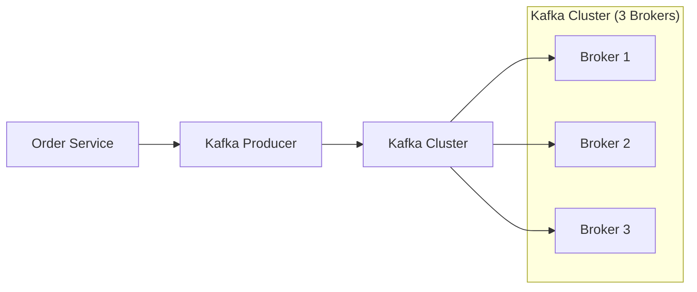

The kafka producer is the component that writes to the kafka cluster. It is configured for max durability:

```
enable.idempotence = true
acks = all
retries = Integer.MAX_VALUE
max.in.flight_requests = 5
compression.type = snappy
batch.size = 32768
linger.ms = 5
```

in Golang, using `github.com/confluentinc/confluent-kafka-go/kafka`, it can be configured like this

```go
p, _ := kafka.NewProducer(&kafka.ConfigMap{
    "bootstrap.servers":  brokers,
    "acks":               "all",
    "enable.idempotence": true,
    "compression.type":   "snappy",
    "linger.ms":          5,
})
```

`acks=all` means the producer waits for the leader broker AND all in-sync replicas to acknowledge the write before returning success. This is the strongest possbile durability guarantee -- the write survives any single broker failure.

`enable.idempotence=true` assigns each producer a unique Producer ID and tags each message with a monotonically increasing sequence number. If a message is sent twice due to a retry (the ack was lost on the network), the broker detects the duplicate sequence number and silently discards it. Exactly-once delivery at the producer level, built into Kafka.

`snappy compression` reduces messages size by ~40-60% with minimal CPU overhead - important at high throughput

`linger.ms = 5` waits up to 5ms for more messages before sending a batch. This trades a tiny bit of latency for much higher throughput at peak load.

Delivery reports arrive on a Go channel (`p.Events()`). A goroutine drains this channel and logs errors - never block the publish path waiting for delivery confirmation synchronously

### Kafka cluster
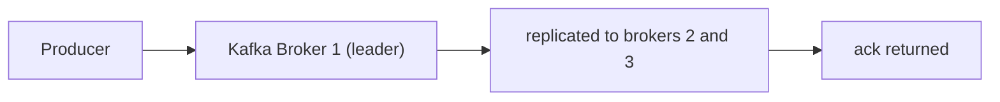
Kafka is the spine of the system but it not a `queue`. A queue deletes a message once consumed. Kafka keeps every message for a configurable `retention` period (here. 7days). 

This means, one can replay events: If the Payment Consumer has a bug, fix it, redeploy and replay the last 6 hours of `orders.created` events

The cluster runs 3 brokers with a replication factor 3. Every message is written to 3 independent machines before the producer gets an `ack`. `min.insync.replicas=2` means we can lose one broker entirely and writes continue without interruption.

Topics are partitioned. The partition key is `customer_id`. All events for one customer always land the same partition guaranteeing per-customer ordering. The number of partitions (32 for orders.created) caps the max parallelism of consumer groups

```
orders.created                                  32 partitions . 7d retention
orders.paid                                     32 partitions . 7d retention
orders.fulfilled                                16 partitioned . 30d retention
orders.dlq                                      8 partitions . 14d retention
```

The `DLQ` (Dead letter queue) is where messages go after 3 failed consumer retries. Nothing is silently dropped. A Prometheus alert fires when DLQ depth grows above 0.

### Schema Registry
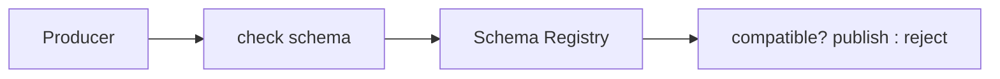

Schema registry stores all Protobuf schema definitions and enforces compatibility rules. Every time a producer publishes a message, it registers the schema (or validates against the existing one). Every consumer uses the registry to deserialise the binary payload correctly.

The key feature is `backward compatibility enforcement`. If a developer tries to publish a schema change that would break existing consumers - for example, removing a required field or changing a field type - the registry rejects the schema registration before the code ever reaches production. So, for example a v2 producer publishing a new optional fields won't break a v1 consumer that's still reading the old schema - Protobuf ignores unknown fields. Zero-downtime schema evolution.

## 2. Consumers and SAGA 
How 4 independent services fan out from the Kafka event, how SAGA orchestrator coordinates distributed transactions and how KEDA keeps them scaled to demand.

### Payment Consumer

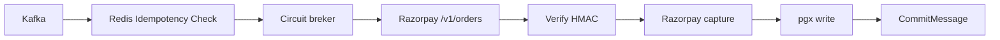

Payment consumer is a go binary consuming `orders.created`. It is the most critical service in the system -  a mistake here double-charges or loses a payment 

Circuit breaker in Go uses `github.com/sony/gobreaker`. The breaker wraps both RazorPay API calls
```go
cb := gobreaker.NewCircuitBreaker(gobreaker.Settings{
    Name:        "razorpay",
    MaxRequests: 3,
    Interval:    30 * time.Second,
    Timeout:     60 * time.Second,
    ReadyToTrip: func(counts gobreaker.Counts) bool {
        failRatio := float64(counts.TotalFailures) /
                     float64(counts.Requests)
        return counts.Requests >= 5 && failRatio >= 0.5
    },
})
```

If RazorPay's error rate exceeds 50%, over 30 seconds, the circuit opens - the consumer publishes a failure event instead of calling RazorPay, triggering SAGA orchestration. It half opens after 60 seconds to probe recovery.

Razorpay's two-step flow: first `/v1/orders` to create the razorpay order, then `POST /v1/payments/{id}/capture` after authorization. Verify `razorpay_signature` (HMAC-SHA256) before capturing

`Idempotency`, check redis for the order's key before calling razorpay. Kafka offset confirm via `confluent-kafka-go CommitMessage()` only after pgx write succeeds.

Never commit the Kafka offset before completing the downstream write. At-least-once delivery is safe only when processing is idempotent which is why the redis check is the very first step.


### Inventory Consumer

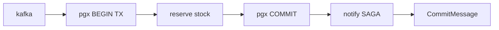

A consumer which reads `orders.created` in parallel with the Payment Consumer. Reserves stock by decrementing available counts in Postgres inside a transaction.

Notifies SAGA orchestrator of its outcome. On failure, the SAGA orchestrator publishes a compensation event that triggers a RazorPay refund via the Payment Consumer.

### Notification Consumer

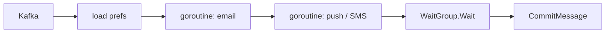

A consumer consuming `orders.created, orders.fulfilled`. Sends notifications via HTTP calls to AWS SES (email), FCM (push), or Twilio (SMS) depending on customer preferences.

Go's goroutine model makes fan-out cheap - send email, push and SMS concurrently using `sync.WaitGroup` with per-channel error collection. Total notification time = slowest channel, not sum of all channels.

Notifications are fire-and-forget from the SAGA's perspective. A failed notification never triggers a refund - retried up to 3x then routed to DLQ.

### Audit Consumer

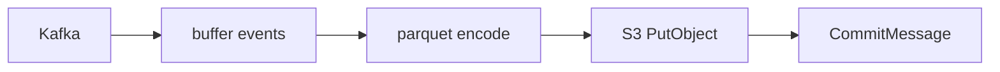

A consumer that reads every order-related topic and writes batched Parquet files to object storage using `parquet-go`. Batches 1000 events or flushes every 30 seconds.

Parquet is columnar and snappy-compressed - a month of events would be 50GB as JSON becomes ~8GB as Parquet, directly querable by Athena/BigQuery

S3 Object Lock in WORM mode prevents deletion by anyone for the configured retention period - required for financial compliance.

### SAGA Orchestrator

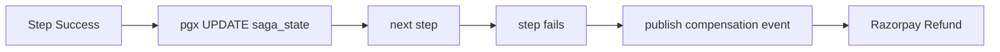

A Service that implements a state machine persisted in Postgres. It has state transitions

```go
type SAGAState string
const (
    StatePending    SAGAState = "pending"
    StatePaid      SAGAState = "paid"
    StateReserved  SAGAState = "reserved"
    StateFulfilled SAGAState = "fulfilled"
    StateRefunding SAGAState = "refunding"
    StateCancelled SAGAState = "cancelled"
)
```

The orchestrator writes its state in the same postgres transaction as the business data - so if process crashes mid-SAGA. It resumes exactly where it left off on restart.

Razorpay compensation is `POST /v1/payments/{id}/refund` - also wrapped in a `sony/gobreaker` circuit breaker.

Every SAGA step must have a compensation. Payment compensation = RazoryPay refund API. Inventory Compensation = release reservation via `pgx UPDATE`. Notification compensation = sends cancellation message

### KEDA AutoScaler

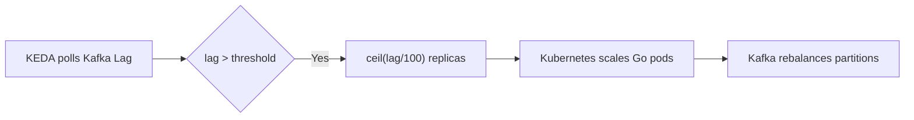

KEDA watches the Kafka consumer group lag for each Go consumer deployment and scales Kubernetes pods propotionally. Standard HPA scales on CPU, a Go consumer with a backlog of 50,000 messages might be at 2%CPU. KEDA surfaces actual lag as the scaling signal

```yaml
triggers:
- type: kafka
  metadata: 
    consumerGroup: payment-consumer-group
    topic: orders.created
    lagThreshold: "100"

maxReplicaCount: 32 # matches partition count
```

Go's low memory footprint (`~10-20mb per consumer binary`) means one can scale to 32 pods (one per partition) far more cheaply than equivalent JVM-based consumers


## 3. Storage, Pub/Sub and Observability
### Postgres 18

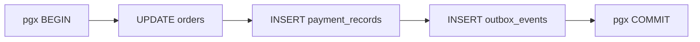

Never use async commit for `payment_records` or `outbox_events`. The `~10ms` window where data is in memory but not flushed means a power failure could lose a financial write.

### Postgres Read replica

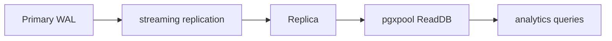

A second `pgxpool` connection string pointing at the replica. The application layer routes all `SELECT-only` queries (dashboards, reports, admin views) to the replica-pool - keeping the primary free for writes.

The replica rejects writes at the storage level. Routing is forced in the Go servicelayer: a `ReadDB` and `WriteDB` pool, with code review enforcing which queries go where.

### Redis Cluster
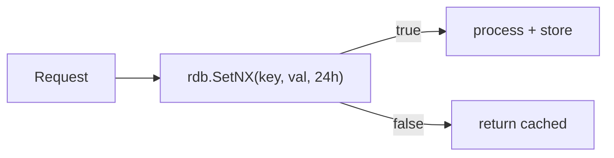

The Payment consumer and Order Service both check idempotency keys before any write

```go
set, err := rdb.SetNX(ctx,
    "idempotency:"+key,
    responseJSON,
    24*time.Hour,
).Result()
// set=true  → first time, proceed
// set=false → duplicate, return cached response
```

### Outbox Relay

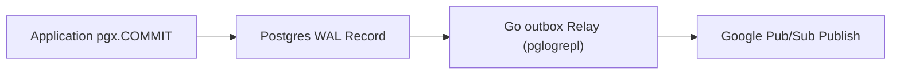

Instead of using Debezium, we use `jackc/pglogrepl` for the go-native outbox relay. It runs independently as a background worker. The relay establishes a logical replication stream with PostgresSQL, tailing the WAL directly, and publishes those events to Google Pub/Sub.

The `outbox_events` table is written atomically inside standard application database transactions. Once `pgx COMMIT` is issued and postgres writes it to disk, go relay guarantees it will eventually catch the change and publish it - even if the relay crashes or restarts mid-flight. 

### Google Pub/Sub
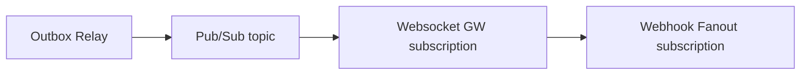

The websocket gateway and websocket fanout are both subscribers. Ordering keys (set to `order_id`) preserve event sequence per order across the async delivery boundary.

### Websocket Gateway

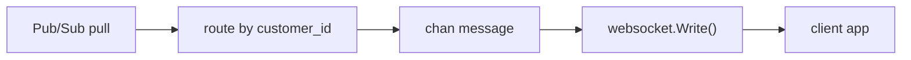

An http server using `nhooyr.io/websocket` (idiomatic Go, context-aware). Each active client connection gets a goroutine. Go's goroutine scheduler handles tens of thousands of concurrent connections on a single binary

```go
conn, _ := websocket.Accept(w, r, nil)
// goroutine per connection:
go func() {
    for msg := range customerChan[customerID] {
        conn.Write(ctx, websocket.MessageText, msg)
    }
}()
```

A pub/sub pull subscriber routes messages to the right channel by `customer_id`. End-to-End: Postgres `COMMIT -> WAL -> Outbox relay -> Pub/Sub -> Websocket push` ~100-150ms.

### Webhook Fanout
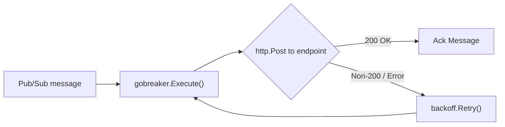

Deliver HTTP POST callbacks to third party systems. Retry logic uses exponential backoff. Per endpoint circuit breaking .

```go
op := func() error {
    resp, err := http.Post(endpoint, "application/json", body)
    if err != nil || resp.StatusCode >= 500 {
        return backoff.Permanent(err) // or retryable
    }
    return nil
}
backoff.Retry(op, backoff.NewExponentialBackOff())
```

Every payload is signed with HMAC-SHA256 using `crypto/hmac`.

### OpenTelemetry + Jaeger

```mermaid
flowchart LR
    A[otel middleware] --> B[span per request]
    B --> C[context.Context carries trace]
    C --> D[OTel collector]
    D --> E[Jaeger UI]
```

HTTP middleware auto-instruments via `otelhttp.NewHandler()`. Kafka spans are created manually or via `otelkafka` contrib package.

```go
// HTTP auto-instrument
mux := chi.NewRouter()
mux.Use(otelchi.Middleware("order-service"))

// Manual span
ctx, span := tracer.Start(ctx, "razorpay.capture")
defer span.End()
// ... call Razorpay
span.SetAttributes(attribute.String("order_id", id))
```

Trace context propagates via W3C headers on HTTP and via Kafka message headers across the async boundary. One trace ID spans the entire order journey from API Gateway to Websocket push.

### Prometheus + Grafana 

```mermaid
flowchart LR

A[promauto registers metrics] --> B[Prometheus scrapes / metrics]
B --> C[Grafana SLO dashboards]
C --> D[burn rate alert]
D --> E[PagerDuty]
```

Every go binary exposes `/metrics` on a dedicated port. `promauto` makes registration one-liners:
```go
var orderLatency = promauto.NewHistogramVec(
    prometheus.HistogramOpts{
        Name:    "order_creation_duration_seconds",
        Buckets: prometheus.DefBuckets,
    },
    []string{"status"},
)
```

1. P99 order creation  `<200ms`
2. P99 payment processing `<2s`
3. Status push to client `<500ms`
4. Kafka consumer lag `alert >10k`
5. Razorpay capture lag `alert >1h uncaptured`

New SLO for Razorpay: alert when any authorized payment is uncaptured for more than 1 hour. This gives 4.9 days of buffer before the 5-day auto-refund window closes.