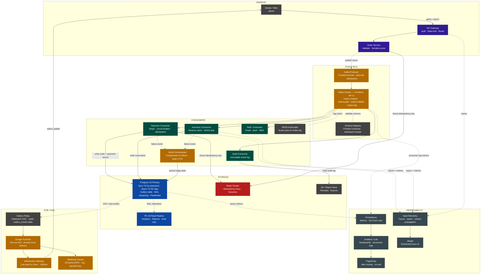
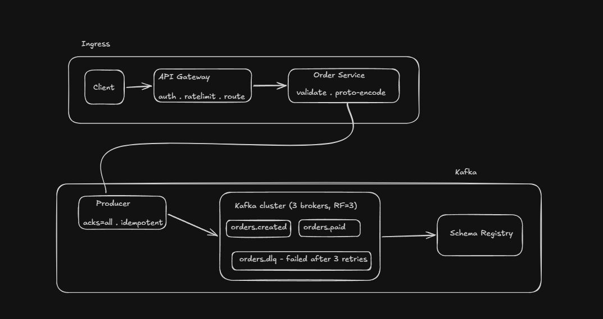
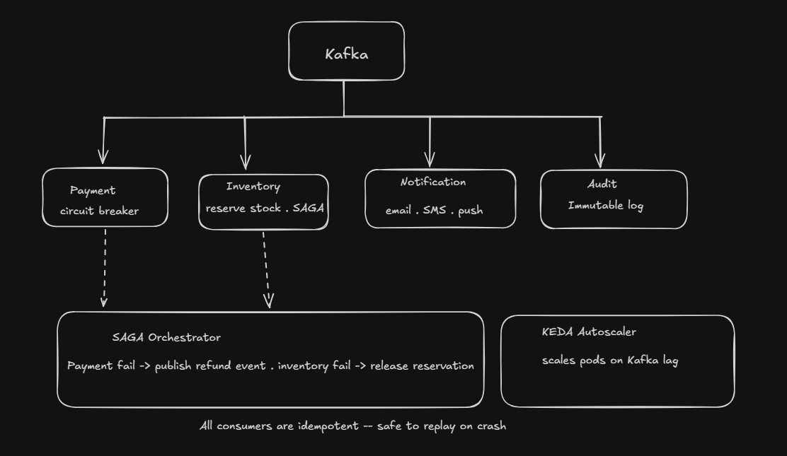
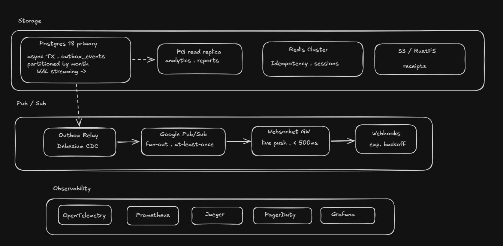
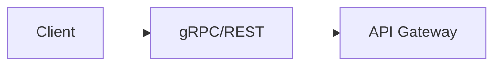
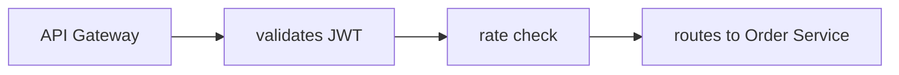
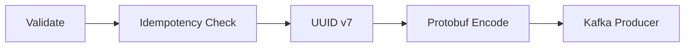
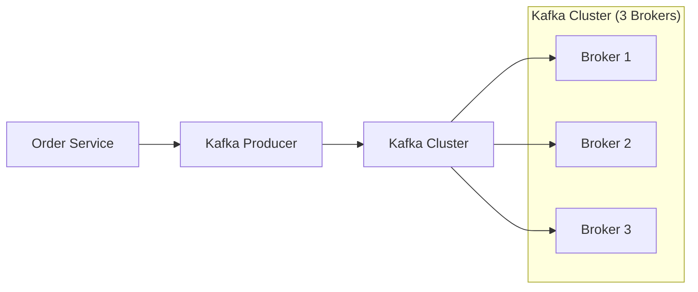
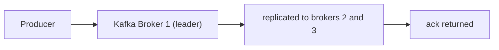
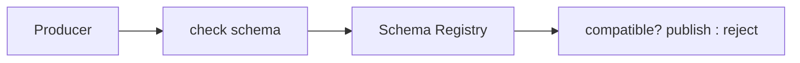

# Real-Time Order Processing System — System Design



---

## Key design decisions

- **Outbox pattern** — Postgres and Kafka writes are atomic via the `outbox_events` table; Debezium CDC relays to Pub/Sub, guaranteeing no lost events even on crash.
- **SAGA orchestrator state** — persisted in the primary so it survives restarts and can resume mid-flow.
- **Read replica** — receives only WAL replication from primary; no application writes ever target it.
- **Idempotency keys** — checked in Redis by the Order Service on ingress and by the Payment Consumer before charging, preventing duplicate orders and double charges.
- **Google Pub/Sub as fan-out hub** — WebSocket Gateway and Webhook Fanout are both *subscribers*; adding a new subscriber (e.g. a data warehouse connector) requires no changes to upstream services.

## Design


This is the top level data flow layer where data flows from API Gateway to producer into Kafka cluster.

Once the event is on Kafka, four independent consumer services read it in parallel. Here is the SAGA orchestrator design




Finally, the storage and real-time delivery layer - where the postgres outbox bridges the internal event bus to the customer-facing push layer.



## 1. Ingress and Kafka Tier
How a customer's tap-to-order becomes a durable event on the Kafka bus.

### Client

User taps on 'place order', the client sends an `HTTP/2` request using `gRPC`(mobiles), `HTTP`(browsers). Every request is encrypted over TLS

Client also generates an <b>idempotency key</b> - random UUID and attaches it to every request. If the network drops and client retries, this key lets the server recognize the duplicate and return the original result instead of placing the order <b>twice</b>

`Why gRPC?` -> gRPC uses Protobuf which is 10x smaller than JSON and strongly typed. So, a change in schema does not break the old clients because Protobuf ignores unknown fields.

### API Gateway

It is a single public facing entry point. Before any request touches the business logic, the gateway performs three things in order

- Authentication:- It validates the `JWT` token in the Authorization header. Invalid or expired tokens are rejected with a `401 Unauthorized` 
- Rate limiting:- Each customer is capped at a configurable request rate (e.b 100 req/s). This prevents a single bad actor or client from flooding the Order Service. Response above the limit get `429 Too many Requests`.
- Routing:- Based on the path and headers, the gateway routes the request to the correct upstream - in this case `Order Service`. In other largers systems, API Gateway also handles `A/B` routing, canary splits and header injection

The gateway also terminates TLS, so internal services communicate over plaintext within the cluster - simplifying mTLS configuration for internal hops.

### Order Service


This is the first piece of business logic. It recieves the authenticated, rate-limited request from the gateway and does 4 things:

- Validates the request:- Is the customer's cart non-empty? Are all item IDs valid? Is the delivery address in a supported region? Is the pricing consistent with the catalog? Anything invalid returns `422 Unprocessable Entity`.
- Checks idempotency:- It looks up the request's idempotency key in Redis. If found, it returns the original response - the order isn't placed again. If not found, it stores the key and proceeds.
- Assigns a UUIDv7 order ID:- UUID v7 is time sortable - unlike UUID v4, it encodes millisecond timestamp in its leading bits. This means rows inserted in order are also sorted in order on disk, dramatically improving B-tree index performance on time-range queries.
- Serialises to Protobuf:- The order is encoded as binary Protobuf message according to the schema in the Schema Registry. The binary payload is then handled to the Kafka Producer.

HTTP Response is `202 Accepted` returned immediately after the Kafka publish is acknowledged. The customer does not wait for payment, that happens asynchronously downstream

### Kafka Producer


The kafka producer is the component that writes to the kafka cluster. It is configured for max durability:

```
enable.idempotence = true
acks = all
retries = Integer.MAX_VALUE
max.in.flight_requests = 5
compression.type = snappy
batch.size = 32768
linger.ms = 5
```

`acks=all` means the producer waits for the leader broker AND all in-sync replicas to acknowledge the write before returning success. This is the strongest possbile durability guarantee -- the write survives any single broker failure.

`enable.idempotence=true` assigns each producer a unique Producer ID and tags each message with a monotonically increasing sequence number. If a message is sent twice due to a retry (the ack was lost on the network), the broker detects the duplicate sequence number and silently discards it. Exactly-once delivery at the producer level, built into Kafka.

`snappy compression` reduces messages size by ~40-60% with minimal CPU overhead - important at high throughput

`linger.ms = 5` waits up to 5ms for more messages before sending a batch. This trades a tiny bit of latency for much higher throughput at peak load.

### Kafka cluster

Kafka is the spine of the system but it not a `queue`. A queue deletes a message once consumed. Kafka keeps every message for a configurable `retention` period (here. 7days). 

This means, one can replay events: If the Payment Consumer has a bug, fix it, redeploy and replay the last 6 hours of `orders.created` events

The cluster runs 3 brokers with a replication factor 3. Every message is written to 3 independent machines before the producer gets an `ack`. `min.insync.replicas=2` means we can lose one broker entirely and writes continue without interruption.

Topics are partitioned. The partition key is `customer_id`. All events for one customer always land the same partition guaranteeing per-customer ordering. The number of partitions (32 for orders.created) caps the max parallelism of consumer groups

```
orders.created                                  32 partitions . 7d retention
orders.paid                                     32 partitions . 7d retention
orders.fulfilled                                16 partitioned . 30d retention
orders.dlq                                      8 partitions . 14d retention
```

The `DLQ` (Dead letter queue) is where messages go after 3 failed consumer retries. Nothing is silently dropped. A Prometheus alert fires when DLQ depth grows above 0.

### Schema Registry


Schema registry stores all Protobuf schema definitions and enforces compatibility rules. Every time a producer publishes a message, it registers the schema (or validates against the existing one). Every consumer uses the registry to deserialise the binary payload correctly.

The key feature is `backward compatibility enforcement`. If a developer tries to publish a schema change that would break existing consumers - for example, removing a required field or changing a field type - the registry rejects the schema registration before the code ever reaches production. So, for example a v2 producer publishing a new optional fields won't break a v1 consumer that's still reading the old schema - Protobuf ignores unknown fields. Zero-downtime schema evolution.